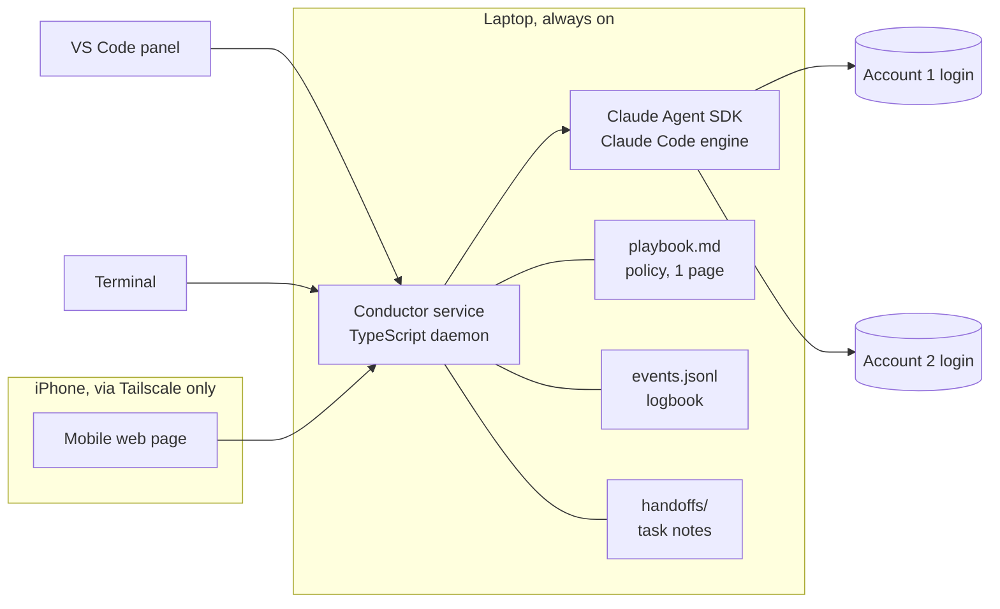
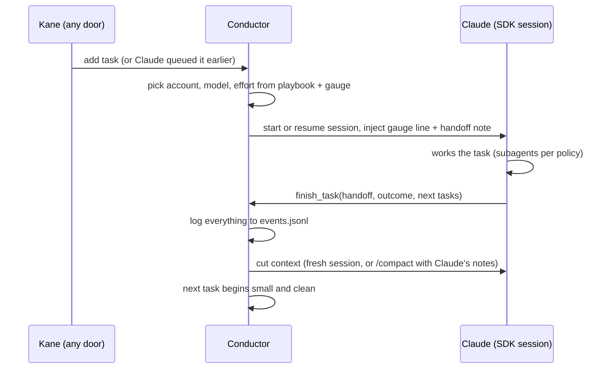

# Conductor, a self-managing harness for Claude

Working name: **Conductor**. Placeholder, rename freely. Revision 2, 2026-08-01: revision 1 plus
the publishing posture and other-engines sections. This repo is Conductor's home.

One line: a small always-on service on the laptop that runs Claude sessions through the Claude
Agent SDK and gives Claude the three things it needs to manage itself: live numbers, rules it can
rewrite, and memory of what happened. The human stops babysitting context, limits, and model
choice.

## The bet

Claude is better than a human at deciding when to cut context, what deserves an expensive model,
and when to slow down before a usage limit. Today it cannot act on that judgment because the
standard apps give it no numbers and no buttons. Conductor supplies both and then stays out of the
way. The intelligence stays in the model. The tool stays small.

## Goals

1. **Context is managed, never endured.** One task, one cut. Claude finishes a bounded task, hands
   off, and the context is cut on purpose. Context never balloons until auto-compact fires on its
   own. Auto-compact remains only as an emergency backstop.
2. **Limits never halt progress, and paid usage never goes to waste.** Claude sees the 5-hour and
   weekly numbers for every account, paces heavy work, queues what can wait for a reset, and spends
   remaining headroom on cheap useful work instead of leaving it unused.
3. **The right model at the right moment.** Claude chooses main-session and subagent model and
   effort per task from a written policy: Fable for the hardest calls, Opus for building, Sonnet or
   Haiku for routine work.
4. **Subagents at every level.** A registry of named subagent profiles, each with default model and
   effort, all overridable per task by policy.
5. **It learns.** Every number and decision is logged. A periodic review turns the log into edits to
   the policy file. Management gets better with use.
6. **Faces where Kane works.** A VS Code panel as the main face, and a phone page over a private
   network to continue or start laptop sessions from an iPhone.
7. **Accounts are first class.** Fast switching between Claude accounts, per-session account choice,
   and usage shown across all accounts in one gauge. Folds in the existing account-switcher
   extension.

## Non-goals for version 1

- No hosted or paid offering of any kind, ever, without Anthropic approval (see Publishing
  posture). The repo may be public; the tool is self-run.
- No visual polish race with the official Claude Code extension. The chat surface starts plain.
- No cloud backend. Everything runs and stays on the user's devices.
- No bundled credentials and no API-key requirement: subscription login, brought by the user.

## Design principles

- **Give Claude eyes, rules, and memory. Do not build a boss.** Conductor never overrides Claude's
  judgment except at a few hard rails written in the policy file.
- **Simplicity budget.** State lives in three plain things: one policy file, one log file, one
  folder of handoff notes. Claude gets one custom tool in v1. Every feature must justify its bytes.
- **The cut point is the control point.** Because context is cut at task boundaries, every boundary
  is also the free moment to change model, effort, and account. One mechanism serves three goals.
- **One engine, many doors.** VS Code, phone, and terminal are thin faces over the same service.
  No capability lives in only one face.
- **Trust but verify the platform.** Anything resting on undocumented behavior is marked, spiked
  first, and given a fallback.

## Architecture

The **service** is a single TypeScript daemon (Node) started at login. It owns all sessions, all
state files, and the local web server for the doors. VS Code talks to it over a local socket. The
phone talks to it only over the Tailscale interface.

The **engine** inside each session is the Claude Agent SDK: full Claude Code (tools, skills,
CLAUDE.md, MCP, subagents, hooks) as a library. Conductor adds its own pieces around it.

## The core loop: one task, one cut

Mechanics, all on documented SDK surface:

- **The tool.** Claude gets one custom in-process tool, `finish_task`. Input: a handoff note (what
  was done, what matters, open threads), an outcome verdict, and optional follow-up tasks for the
  queue. Calling it is how Claude asks for the cut.
- **The cut.** Two modes, chosen by playbook rule. **Fresh cut** (default): the service ends the
  session and starts the next task in a new one, feeding back only the handoff note and pointers.
  This beats compaction because Claude wrote the summary deliberately. **Compact cut**: the service
  sends `/compact` with Claude's handoff note as the focus instructions on the resumed session,
  for task chains that genuinely need deep shared history.
- **Mid-task checkpoint.** If the gauge runs high mid-task, the injected gauge line tells Claude to
  call `finish_task` early with a checkpoint handoff. Same tool, no second mechanism.
- **Backstop.** Auto-compact stays enabled as the emergency floor. A PreCompact hook logs every
  time it fires, because each firing means the loop failed and the playbook should learn.

## The organs

### Gauge

A one-line status injected into every turn plus a panel in each face. Contents: context fill %,
5-hour % and reset time, weekly % and reset time, per account, and per model where the data allows.
Sources, in order of trust:

1. **Context fill:** the SDK's context usage reading. Documented, per session.
2. **Self-metered usage:** the service sums token usage from every SDK result message it sees,
   per model, per account, per rolling window. Always available, never lies about what we spent,
   but must be calibrated against the official percentages.
3. **Official limit %:** the number Claude Code shows its status line. Getting this outside the
   official UI is the main open technical question (see Risks). The existing account-switcher
   extension already reads cross-account usage somewhere; its source gets absorbed here.

Wording rule for the injected line: calm, no countdown alarm. Include a standing sentence that
there is ample room to finish the current step, because models told they are near a limit can
panic and wrap up early.

### Playbook

`playbook.md`, hard-capped at roughly one page. Plain-language rules Claude reads every turn and
may propose edits to. Examples of the kind of rule it holds:

- Above 70% of the 5-hour window: subagents drop to Sonnet, effort medium; queue Fable work.
- Fable is for design decisions, gnarly debugging, and final review. Never for file sweeps.
- Above 60% context mid-task: checkpoint at the next natural boundary.
- Account rotation order and what each account is reserved for.
- Hard rails the service enforces itself, not just advises: e.g. never start a Fable task above
  85% of its window; destructive actions always require a human tap.

### Logbook

`events.jsonl`, append-only. One line per meaningful event: task start and finish with model,
effort, account, token usage, context peak, cut mode, gauge readings, playbook rule fired,
backstop auto-compacts, limit hits, deferrals. Cheap to write, easy to mine.

### Review (the learning loop)

A scheduled Conductor task like any other, run on a cheap model: read the last week of
`events.jsonl`, compare against the playbook, propose playbook edits with evidence, apply the
reversible ones, park the rest for the human. Merge duplicates, drop rules that never fire,
strengthen rules that keep proving right. The playbook page cap forces ruthlessness.

### Task queue

Ordered list of tasks with: prompt, project folder, wanted-by, weight (how heavy it is expected to
be), and any pinned model or account. Sources: the human from any door, and Claude itself via
`finish_task` follow-ups. The service schedules from the queue using playbook and gauge: heavy
tasks wait for resets, light tasks mop up remaining headroom. This is how limits stop halting
progress and paid usage stops going unused.

### Subagent registry

Named profiles passed to the SDK's agents option on every session: e.g. scout (Haiku, low),
builder (Opus, medium), reviewer (Opus, high), advisor (Fable, high, rare). The playbook maps task
types and gauge states to profiles. Claude picks per call; the registry just makes the choices
consistent and loggable.

### Account layer

Each account is a stored login the service can point a session at (config-directory switching, the
same mechanism the existing switcher extension uses). Per task, the service picks the account by
playbook rule. The gauge shows all accounts side by side. Note the policy line below before ever
letting rules move work between accounts automatically.

## Other engines (Sol and friends)

Conductor can orchestrate models beyond Claude, at two levels:

- **Level one, inside sessions, free on day one.** Every Conductor session is full Claude Code, so
  Claude can call other models as tools: the codex CLI from bash, or a codex MCP server, for
  adversarial review (the Sol pattern). The playbook makes it policy ("major work gets a Sol
  review before finish_task"); Conductor just logs that it happened.
- **Level two, Conductor-level runners, a later milestone.** The subagent registry and task queue
  treat a runner as a profile, and a profile may map to an external engine instead of a Claude
  session: a task tagged adversarial-review runs headless Codex directly. The gauge was designed
  for plural buckets, so other vendors' subscription limits sit beside the Claude ones, and the
  pacing brain can shift review work onto whichever tank has fuel.

The boundary: the brain inside a Claude session's loop is always Claude. Other models take part as
tools Claude calls, or as separate jobs Conductor runs beside the Claude ones. In practice this
costs nothing; those are the two shapes the Sol pattern already uses.

## Doors

### VS Code panel (first face)

Webview panel. V1 contents: session list, chat with tool-call display and approve/deny buttons,
the gauge strip, task queue view, and the playbook opened as a normal editable file. Status-bar
item shows the two most urgent numbers. Later: diffs, session history browser, log charts.

### Phone door (iPhone)

A small mobile web page served only on the Tailscale interface. V1 contents: gauge, session list,
continue a session (read latest turns, send a message, approve or deny), start a new session
(pick from an allowlist of project folders, pick account, type the task), and the task queue.
Push-style nudges can come later; v1 is pull only.

### Terminal

Thin CLI over the same service for scripting and for headless overnight queues. Lowest priority,
kept alive so no capability becomes VS Code-only.

## Security

- The phone page binds to the Tailscale address only. Nothing listens on the open internet, no
  port forwarding, no third-party relay, content never leaves the user's devices.
- A PIN (or passkey) on the phone page as a second lock on top of device membership.
- Approvals: the same permission model Claude Code uses, surfaced as buttons. Destructive actions
  always stop for a tap, on every door, regardless of playbook.
- Project folders reachable from the phone are an explicit allowlist.
- Secrets: no Anthropic credentials in the repo or the state files. Logins stay where the official
  tools store them. `ANTHROPIC_API_KEY` stays unset everywhere so subscription auth is used.
- The laptop must be awake for remote use: setup includes a keep-awake step while sessions run.

## Publishing posture

This repo may be public. Publishing source code is not the thing Anthropic's SDK rule restricts;
the rule is about offering claude.ai login as part of a product or service you provide. Conductor
stays clearly on the safe side of that line:

- Users bring their own Claude Code install and their own login; their usage runs under their own
  agreement with Anthropic. The README says this plainly.
- No hosted version, no paid tier, no bundled or proxied credentials, no telemetry.
- No marketing framed as getting more out of usage limits. Conductor is self-management and
  efficiency: better cuts, better pacing, better model choice.
- The account layer is for managing your own legitimately separate accounts. The playbook must not
  automate schemes whose only purpose is dodging a single account's limits; pacing and queueing
  are the honest levers.
- If Conductor ever grows a real audience or any commercial shape, ask Anthropic first, before
  shipping, using a short plain-language description of what it does.

## Grounding (verified against docs, July 2026)

- The Agent SDK is Claude Code as a library: tools, skills, hooks, subagents, sessions.
  https://code.claude.com/docs/en/agent-sdk/overview.md
- A host program can send `/compact` (with focus instructions) and `/clear` programmatically on a
  continued or resumed session. This is the compact trigger.
  https://code.claude.com/docs/en/agent-sdk/slash-commands.md
- Sessions can be resumed and forked; context usage is readable; PreCompact and PostCompact hooks
  exist (PreCompact can block an auto-compact, neither can start one).
  https://code.claude.com/docs/en/agent-sdk/sessions.md
  https://code.claude.com/docs/en/agent-sdk/hooks.md
- Inside the stock Claude Code apps the model cannot press /compact; that is why Conductor owns
  the loop via the SDK.
- Subscription: SDK and `claude -p` usage currently draws from Claude plan limits. Anthropic
  planned to split this into a separate monthly credit on 2026-06-15 and paused the change on the
  day it was due. Either world works for Conductor; the gauge just tracks the right bucket.
  https://support.claude.com/en/articles/15036540-use-the-claude-agent-sdk-with-your-claude-plan

## Risks and open questions (spike before building)

1. **Subscription auth through the SDK on this machine.** Confirm a hello-world SDK session runs
   on the Max login with `ANTHROPIC_API_KEY` unset and shows up against plan usage. Highest value,
   one hour.
2. **Official limit percentages outside the official UI.** Candidate sources: whatever the
   account-switcher extension reads today, the status-line JSON of a parallel Claude Code process,
   or self-metering calibrated once against the official numbers. Pick in the spike, ship with
   self-metering as the floor.
3. **`/compact` behavior through the SDK in practice.** Verify focus instructions are honored and
   the compact boundary is visible to the service. Fallback if flaky: fresh cut only, which is the
   preferred mode anyway.
4. **Billing split returns.** If the separate SDK credit ships later, add it as a bucket in the
   gauge and a line in the playbook. Design assumption: buckets are plural from day one.
5. **Windows service ergonomics.** Auto-start, keep-awake, and Tailscale bind on Windows need one
   honest afternoon of verification.

## Milestones

- **M0, spikes (days):** the five risk items above, each a throwaway script and a written verdict.
- **M1, engine (week 1):** daemon, one SDK session, `finish_task`, fresh cut, gauge line with
  context fill + self-metered usage, `events.jsonl`, minimal CLI door.
- **M2, brain (week 2):** playbook injection and hard rails, task queue with pacing, subagent
  registry, compact-cut mode, backstop logging.
- **M3, faces:** VS Code panel v1 (chat, gauge, queue, approvals).
- **M4, accounts:** account layer, switcher-extension merge, cross-account gauge.
- **M5, phone:** Tailscale page with continue, start, approve.
- **M6, learning:** scheduled review task that edits the playbook with evidence.
- **M7, other engines:** external runners in the registry (headless Codex first) and cross-vendor
  gauge buckets.

Ship one milestone at a time. After M1 the tool is already useful: one task, one cut, numbers on
every turn.
